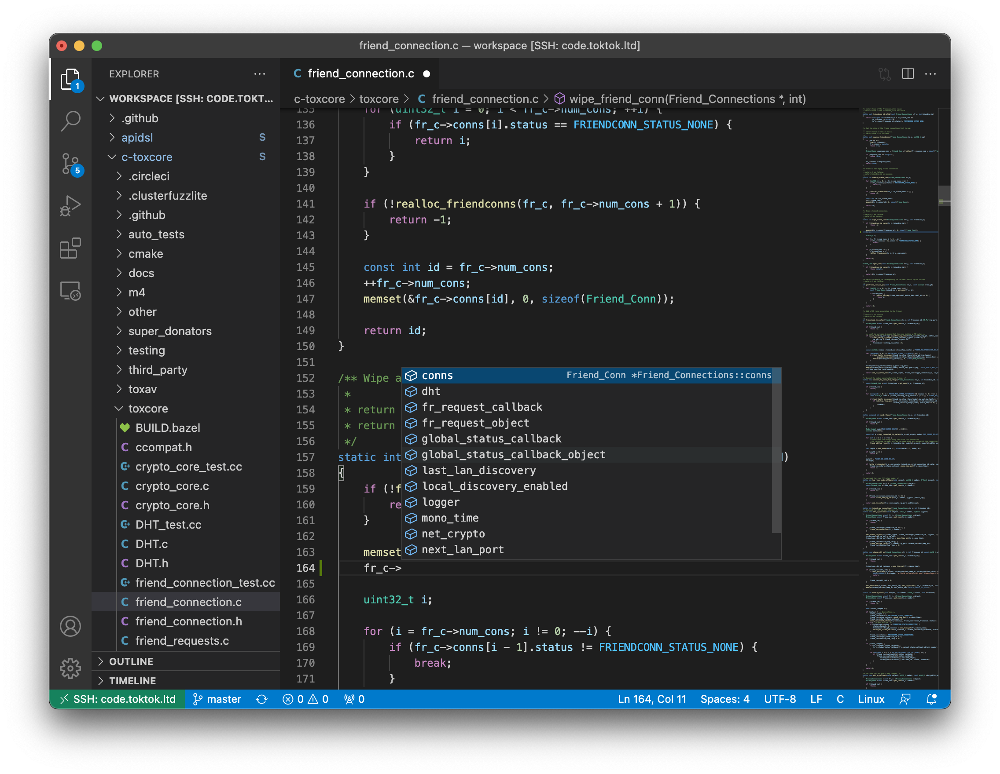

# TokTok Dev Containers

This repository is available as dev containers including `vim` and an `ssh`
server. You can customise it by creating a Docker image derived from
`toxchat/toktok-stack:latest-dev`. An example can be found in the
[Dockerfile](Dockerfile) in this directory.



WARNING: Do not push your derived dev container to a public container
registry if you have key material in it (e.g. GPG keys or SSH private keys).

## Creating the container

To use it, in the simplest case, you do:

```sh
# Get the stack so you can mount them and persist your local changes.
git clone --recurse-submodules https://github.com/TokTok/toktok-stack workspace
# Copy the example home with vim config.
cp -a workspace/tools/built/dev/home .
# Allow yourself to enter the dev container.
cp ~/.ssh/id_rsa.pub home/.ssh/authorized_keys
# Build and run your derived dev image.
workspace/tools/built/dev/run_dev_container.sh iphydf/toktok-dev
```

### Setting up remotes

You can use the tool `git-remotes` to set up the correct origin and upstream
remotes as well as a few well-known contributors:

```sh
# Inside the container, use your GitHub username here.
tools/git-remotes iphydf
```

## Using the container

You can either ssh into it ([`run_dev_container.sh`](run_dev_container.sh)
will listen on port `2224`):

```sh
ssh -p2224 builder@localhost
```

Or use Visual Studio Code's [remote](https://aka.ms/vscode-remote/download/extension)
feature and enter the above ssh line in the remote connection dialog.

## Signing commits

If you want to sign your commits, you'll need a GPG key:

```sh
gpg --armor --export-secret-keys iphydf > home/key.pem
```

You'll also need to edit [.gitconfig](home/.gitconfig) to have your name and
GPG key.

## Further customisation

If you want to commit code, you'll need to either enable ssh agent forwarding
or add an ssh key to the container by dropping it into `home/.ssh`, e.g.:

```sh
ssh-keygen -f home/.ssh/id_rsa
```

The [`run_dev_container.sh`](run_dev_container.sh) script will do the above
line for you, but if you want a different ssh key there, you can add one
yourself. Make sure GitHub knows about that ssh key.
